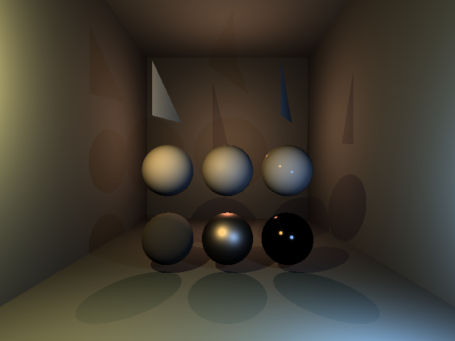
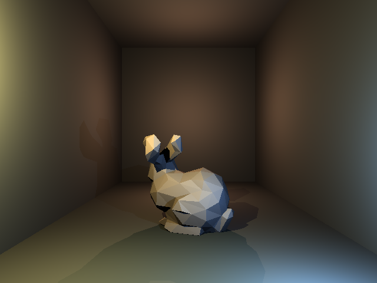

# Softare raytracer

Small raytracer that runs entirely on the cpu. It's able to load in .obj files and it uses multithreading to avoid unbearable slideshows. (although it doesnt run at 30 fps)

## Showcase

  
  

